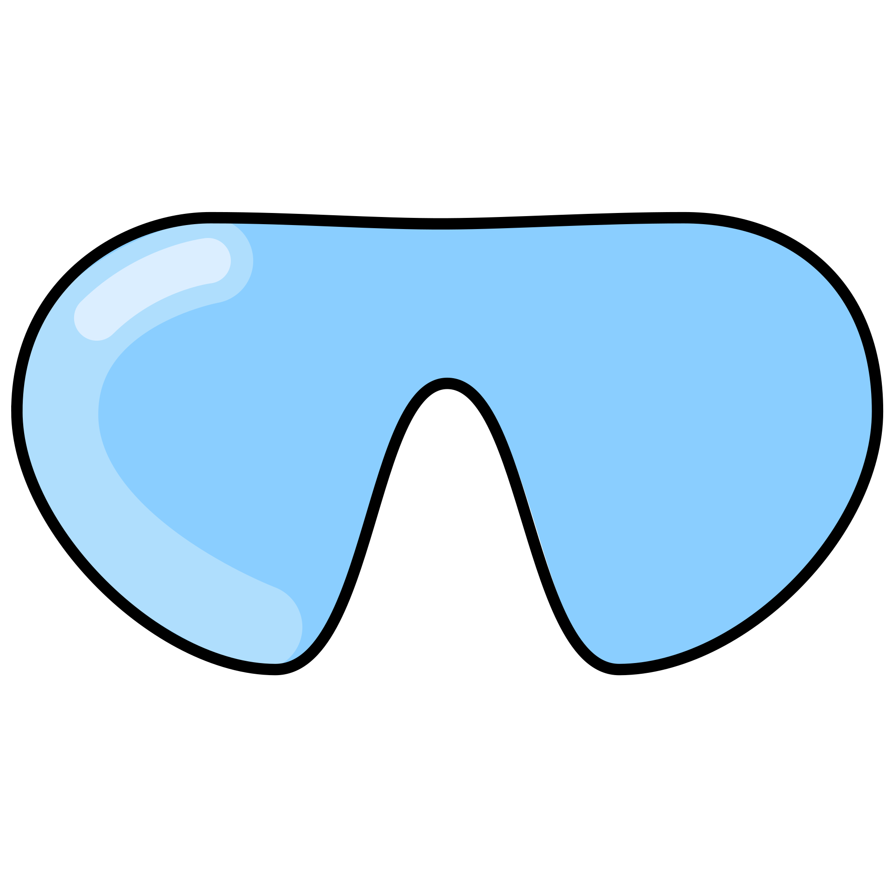

<p align="center">
    
</p>

<p align="center">
    <a href="#badge">
        
    </a>
    <a href="#badge">
        
    </a>
    <a href="#badge">
        
    </a>
    <a href="#badge">
        
    </a>
</p>

# About
DIVE is a spatial framework made by and optimized for Shopware. It can be used directly integrated in a Shopware frontend such as Storefront or in any other frontend you want to use it in, it is not tied to Shopware.

DIVE supplies your frontend application with all needed tooling to set up a basic 3D application with event-based controls called "Actions". For further information, see [Getting started](#getting-started).

# Installation

#### npm:
```
npm install @shopware-ag/dive
```

#### yarn:
```
yarn add @shopware-ag/dive
```

#### Setup in Shopware
Don't forget to include DIVE in your webpack.config.js:
```js
const path = require('path');

module.exports = () => {
    return {
        ...
        resolve: {
            extensions: ['.ts', '.cjs', '.js'],
            alias: {
                three: path.resolve(__dirname, 'path/to/node_modules/three'),
                "@shopware-ag/dive": path.resolve(__dirname, 'path/to/node_modules/@shopware-ag/dive'),
            }
        },
        ...
        module: {
            rules: [
                ...
                {
                    test: /\.(js|ts)$/,
                    loader: 'swc-loader',
                    include: [
                        path.resolve(__dirname, 'path/to/node_modules/three'),
                        path.resolve(__dirname, 'path/to/node_modules/@shopware-ag/dive')
                    ],
                    options: {
                        jsc: {
                            parser: {
                                syntax: 'typescript',
                            },
                            target: 'es2022',
                        },
                    },
                },
                ...
            ],
        }
    };
};
```

# Getting started
Import:
```ts
import { DIVE } from '@shopware-ag/dive'; // <-- import DIVE
```

Instantiate:
```ts
import { DIVE } from '@shopware-ag/dive';

const dive = new DIVE(); // <-- instantiate DIVE
```

DIVE supplies your application with a HTMLCanvasElement that it uses as a render target. After instantiating, you can use the supplied canvas within you frontend code to attach it to your DOM.

```ts
const dive = new DIVE();

const myCanvasWrapper = document.createElement('div'); // <-- create wrapper element
myCanvasWrapper.appendChild(dive.Canvas); // <-- reference DIVE canvas
```

To interact with your newly created DIVE instance you have to perform actions via DIVECommunication. For further information, see [Actions](#actions).
```ts
const dive = new DIVE();

const myCanvasWrapper = document.createElement('div');
myCanvasWrapper.appendChild(dive.Canvas);

const com = dive.Communication; // <-- reference DIVECommunication

com.PerformAction('SET_CAMERA_TRANSFORM', { // <-- perform action on DIVECommunication
    position: { x: 0, y: 2, z: 2 },
    target: { x: 0, y: 0.5, z: 0 },
});
```

# Actions
Actions symbolize the communication between frontend and 3D space. All actions can be performed anywhere, no matter if you are in frontend or 3D.

In addition to the impact that specific actions have, every action can be subscribed to.
```ts
const myCanvasWrapper = document.createElement('div');
const dive = new DIVE();

myCanvasWrapper.appendChild(dive.Canvas);

const com = dive.Communication;

com.Subscribe('SET_CAMERA_TRANSFORM', () => { // <-- add subscription
    // do something
});

com.PerformAction('SET_CAMERA_TRANSFORM', {
    position: { x: 0, y: 2, z: 2 },
    target: { x: 0, y: 0.5, z: 0 },
});
```

Subscribing to an action returns a `unsubscribe()`-callback that should be executed when not needed anymore.
```ts
const myCanvasWrapper = document.createElement('div');
const dive = new DIVE();

myCanvasWrapper.appendChild(dive.Canvas);

const com = dive.Communication;

const unsubscribe = com.Subscribe('SET_CAMERA_TRANSFORM', () => { // <-- save unsubscribe callback
    // do something
});

com.PerformAction('SET_CAMERA_TRANSFORM', {
    position: { x: 0, y: 2, z: 2 },
    target: { x: 0, y: 0.5, z: 0 },
});

unsubscribe(); // <-- execute unsubscribe callback when done
```

In the following you find a list of all available actions to perform on DIVECommunication class via `com.PerformAction()`.

| Action                                                                    | Description
| :---                                                                      | :---
| [GET_ALL_SCENE_DATA](./src/com/actions/scene/getallscenedata.ts)          | Return all scene data that is currently set
| [GET_ALL_OBJECTS](./src/com/actions/object/getallobjects.ts)              | Return a map of all objects
| [GET_OBJECTS](./src/com/actions/object/getobjects.ts)                     | Return an array of all objects with given ids
| [PLACE_ON_FLOOR](./src/com/actions/object/model/placeonfloor.ts)          | Set a model onto to the floor
| [ADD_OBJECT](./src/com/actions/object/addobject.ts)                       | Add an object to the scene
| [UPDATE_OBJECT](./src/com/actions/object/updateobject.ts)                 | Update an existing object
| [DELETE_OBJECT](./src/com/actions/object/deleteobject.ts)                 | Delete an existing object
| [SELECT_OBJECT](./src/com/actions/object/selectobject.ts)                 | Select an existing object in the scene
| [DESELECT_OBJECT](./src/com/actions/object/deselectobject.ts)             | Deselect an existing object in the scene
| [SET_BACKGROUND](./src/com/actions/scene/setbackground.ts)                | Set a background color
| [DROP_IT](./src/com/actions/object/model/dropit.ts)                       | Places the model onto the next underlying object's bounding box
| [PLACE_ON_FLOOR](./src/com/actions/object/model/placeonfloor.ts)          | Places the model onto the floor (zero plane)
| [SET_CAMERA_TRANSFORM](./src/com/actions/camera/setcameratransform.ts)    | Set camera transformation (w/o animation, used to initially set up camera)
| [GET_CAMERA_TRANSFORM](./src/com/actions/camera/getcameratransform.ts)    | Return currenty camera transformation
| [MOVE_CAMERA](./src/com/actions/camera/movecamera.ts)                     | Move camera to a specific position or the position of a previously defined POV (with an animation)
| [RESET_CAMERA](./src/com/actions/camera/resetcamera.ts)                   | Reset camera to original position after MOVE_CAMERA was performed
| [SET_CAMERA_LAYER](./src/com/actions/camera/setcameralayer.ts)            | Set camera layer to switch between live view and editor view
| [ZOOM_CAMERA](./src/com/actions/camera/zoomcamera.ts)                     | Zoom in or out
| [SET_GIZMO_MODE](./src/com/actions/toolbox/select/setgizmomode.ts)        | Set gizmo mode
| [MODEL_LOADED](./src/com/actions/object/model/modelloaded.ts)             | Is performed when a model file is completely loaded

| [UPDATE_SCENE](./src/com/actions/scene/updatescene.ts)                    | Update scene data
| [GENERATE_MEDIA](./src/com/actions/media/generatemedia.ts)                | Generate a screenshot with the specified parameters
