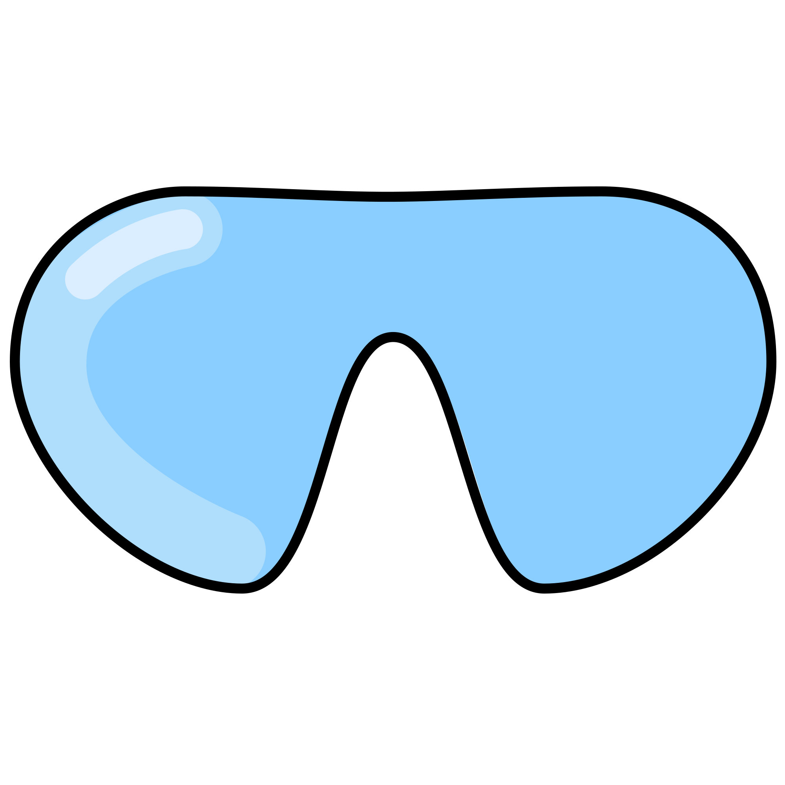

<p align="center">
    
</p>

<p align="center">
    <a href="#badge">
        
    </a>
    <a href="#badge">
        
    </a>
    <a href="#badge">
        
    </a>
    <a href="#badge">
        
    </a>
</p>

## Table of Contents

- [Table of Contents](#table-of-contents)
- [About](#about)
- [Installation](#installation)
- [Getting Started](#getting-started)
  - [Basic Setup](#basic-setup)
  - [Nodes and Components](#nodes-and-components)
  - [Quick View](#quick-view)
- [Plugins](#plugins)
- [Documentation](#documentation)

## About

DIVE is a spatial framework made by and optimized for Shopware. It can be used directly integrated
in a Shopware frontend such as Storefront or in any other frontend you want to use it in, it is not
tied to Shopware.

DIVE supplies your frontend application with all needed tooling to set up a basic 3D application.
A scene is a tree of nodes, and what a node *does* comes from the components attached to it - the
model common game engines use.
Driving a scene from data is the job of the
[state plugin](src/plugins/state/README.md), which adds event-based controls called "Actions".

## Installation

The `@shopware-ag/dive` package can be installed via

```bash
npm install @shopware-ag/dive

or

yarn add @shopware-ag/dive
```

For local development setup, see [Local Development Guide](./docs/local-development.md).

## Getting Started

### Basic Setup

To get started with DIVE, import and instantiate it:

```ts
import { DIVE } from '@shopware-ag/dive';

// Create a DIVE instance
const dive = new DIVE();
const myCanvasWrapper = document.createElement('div');
myCanvasWrapper.appendChild(dive.canvas);
```

### Nodes and Components

Everything in a scene is a `DIVENode`. Geometry, lights and behaviour are components you attach:

```ts
import { DIVENode, MeshComponent, PointLightComponent } from '@shopware-ag/dive';

const model = new DIVENode();
model.addComponent(new MeshComponent());
dive.scene.root.add(model);
await model.requireComponent(MeshComponent).setFromURL('your/asset/uri.glb');
model.dropIt();

const lamp = new DIVENode();
lamp.addComponent(new PointLightComponent());
lamp.setPosition({ x: 0, y: 2, z: 0 });
dive.scene.root.add(lamp);
```

You can write your own components too — see
[Component System Documentation](docs/component-system.md).

### Quick View

For a simpler setup, you can use QuickView to quickly display your assets within a basic default
scene setup:

```ts
import { QuickView } from '@shopware-ag/dive/quickview';

const dive = await QuickView('your/asset/uri.glb');
const myCanvasWrapper = document.createElement('div');
myCanvasWrapper.appendChild(dive.canvas);
```

## Plugins

DIVE comes with several built-in plugins that provide specific functionality. They are self-contained and can be imported as a subpath export from the package:

```ts
import { ARSystem } from '@shopware-ag/dive/ar';

// Initialize AR with options
const arSystem = new ARSystem();
await arSystem.launch('path/to/model.glb', {
    arPlacement: 'horizontal', // or 'vertical'
    arScale: 'auto' // or 'fixed'
});
```

For detailed information about the plugin system, see
[Plugin System Documentation](docs/plugin-system.md).

## Documentation

For detailed documentation, please refer to the following sections:

- [Component System](docs/component-system.md) - Nodes, components, ticking and layers
- [Plugin System](docs/plugin-system.md) - Detailed plugin system architecture and usage
- [Shopware Integration](docs/shopware-integration.md) - Integration with Shopware projects
- [Testing and Quality Assurance](docs/testing.md) - Testing guidelines and best practices
- [Local Development](docs/local-development.md) - Local development setup and workflow
